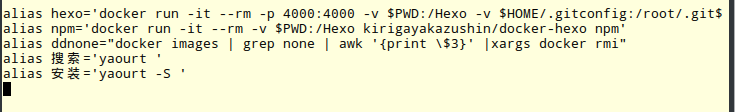
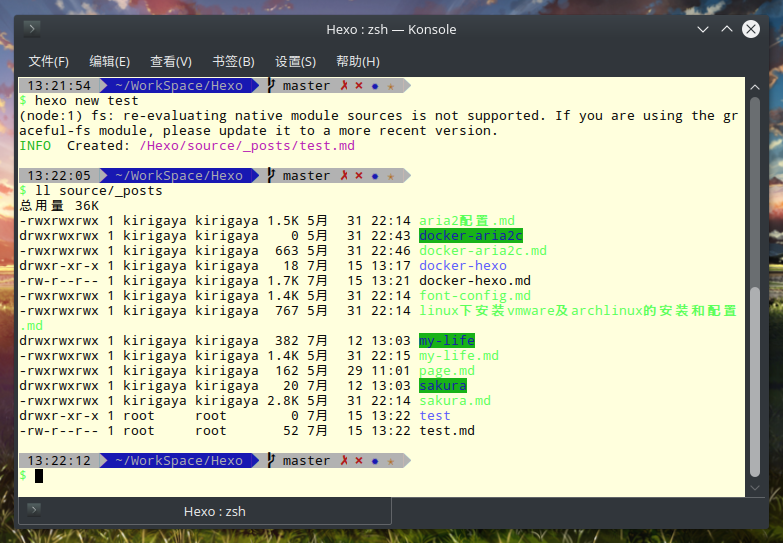
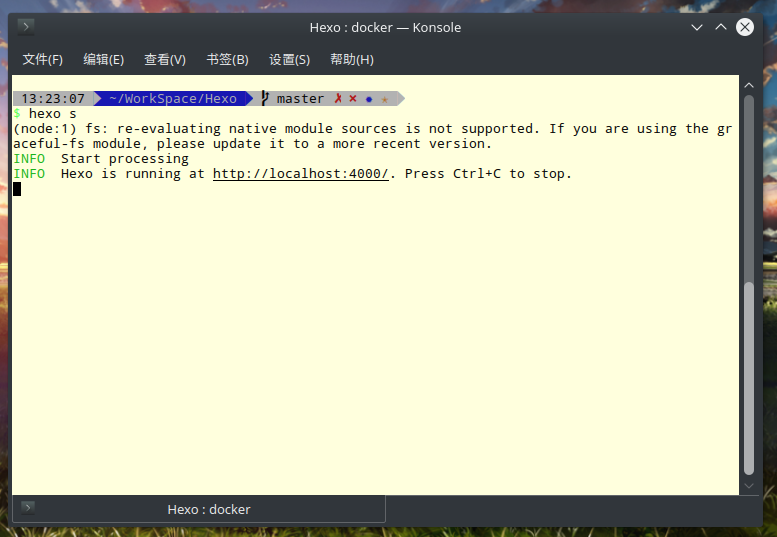
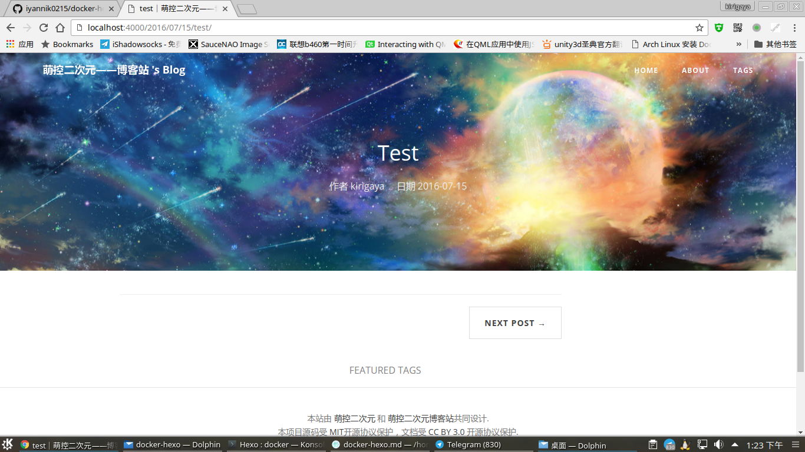
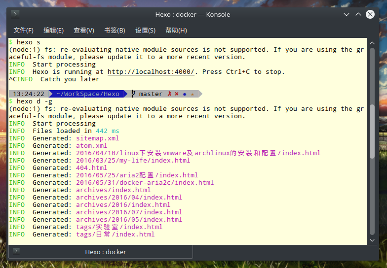
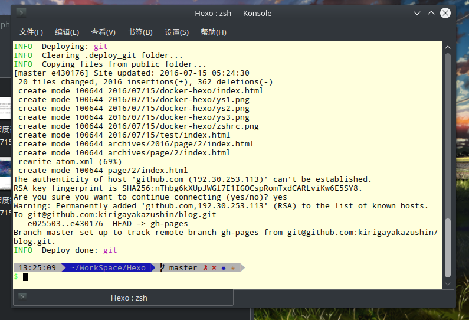

# docker-hexo
安装docker，然后pull镜像

    docker pull kirigayakazushin/docker-hexo

pull镜像以后，写入alias，将docker-hexo当做本地工具。

    alias hexo='docker run -it --rm -p 4000:4000 -v $PWD:/Hexo -v $HOME/.gitconfig:/root/.gitconfig -v $HOME/.ssh:/root/.ssh kirigayakazushin/docker-hexo hexo'

    alias npm='docker run -it --rm -v $PWD:/Hexo kirigayakazushin/docker-hexo npm'

    alias ddnone="docker images | grep none | awk '{print \$3}' |xargs docker rmi"

把以上内容写进rc文件，我是用zsh的，所以写入~/.zshrc。

接下来基本演示一下使用方式。

